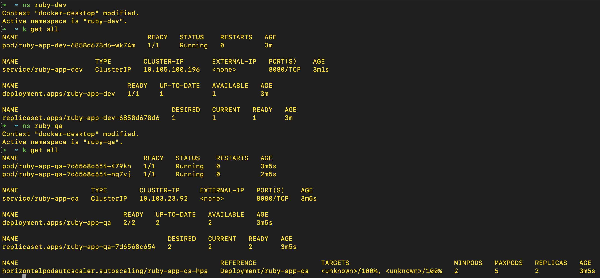

# ruby-app

#### This Repo contain a simple ruby web server application which is hosted on a local kubernetes cluster.
- Build, Test and Scan using GitHub Action
- Deploying using Helm via argoCD deploment

## <u>Module-1 - Pipeline Design</u>

To build this application, I have desgined a pipeline which confure with helm and deploy using argoCD. Below is the design as describe below.


#### **How it will work:**
- When a user will commit any code change in GitHub repo as part of CI job it will trigger github workflow.
- It will build and test the application code and push the image to container registry post vulnerability scan.
- Once the image got pushed it will commit to the repo with image-tag in a specific file in a specific directory.
- Once the code is commited, ArgoCD will initiate the sync with helm chart and initate the deployment.

For an end-to-end CI/CD pipeline branching strategy is very important. Here I have designed branching strategy with git-flow. However, Branching strategy can be configured many ways as per project needs.


Branching Strategy:
- **Main branch (main)**: Contains stable production-ready code.
- **Development branch (development)**: Where active development takes place and features are integrated.
- **Feature branches (feature/<feature-name>)**: Created the development branch for developing new features.
- **Release branches(release/<major. minor. patch>)**: Created for testing and preparing a release, bug fixes only.
- **Hotfix branches(hotfix/<hotfix-name>)**: Used to address critical issues in the production code.
- Build can be triggered by any branch.
- Docker push only restricted to develop/release/hotfix/bugfix branch only, so we can save space/cost in container registry.

Deployment Strategy:
- Develop branch can be deployed in Dev environment only.
- Release branch can be deploys to QA/PreProd and Prod environments.
- If any new changes directly commited to the release branch it has to sync with develop so the code will be same. or it has be commited first in develop and then from develop it can merge to release branch.
- Once the Release is done, Release brnach changes needs to be merge with main branch and add a git tag against that commit.

Benefits:
- It can enable to develop multiple release at the same time by creating multiple release branches.
- Dev environment can be dedicated to the developers only to help them to develop there code.
- Dedicated release branches for each release.
- limited commits/merge to main branch which will be always sync with the prod environment.

## <u>Module-2 - Deploy</u>

I am uisng GitHub action here to build the application, to maintain the DevOps and security best practices I have added multiple jobs for a **standard ruby project**, I will be discussing more in-depth why we need such jobs. Since, this is a simple web server we don't need all the steps, I added comments for the same in pipeline code.
[Please click Here is the Pipeline Path Reference](./.github/workflows/build-and-deploy.yml). I've explained here each and every steps in details.

### Part 1 - Containerise:

#### 1. Build:
I have added a build job which will build the application, since it's a simple application we don't have such requirement but as a standard Ruby project we would need the below steps and checks before proceed to the next steps.

- Checkout Code:
    - Checkout the repo to GitHub runner.
- Cache Ruby Dependency:
    - Enabled cache in GitHub so it can help next time to reduce the dependency download time. [This step is not required here since it's a simple web server application]
- Set-Up Ruby:
    - Install Ruby(I am using 2.7 version here) in GitHub runner. [This step is not required here since it's a simple web server application]
- Install Dependency:
    - Install dependency if any external dependency being used in project. [This step is not required here since it's a simple web server application]
- Build Application:
    - This step will build the application, [This step is not required here since it's a simple web server application]
- Run Unit test:
    - This step will run the unit test cases for the application.
- SonarQube Analyser:
    - This step will analyse the code using sonarqube and publish the report to sonar portal. [am using sonarQube here, there can be other third party tools as well as per project requirements]
- SonarQube quality Check:
    - This steps will check the sonarqube result, it will break the build if quality gate failed.
- Publish Quality Gate Result:
    - This step will get the sonarqube result and publish in GitHub summary page so it will be helpful to developers incase it break the build.

#### 2. Component Test
For component testing in a Ruby application, we need to typically run tests that focus on individual components or units of our codebase. This test is very useful for a proper ruby application but not needed for this simple application, however I added the steps as follows.

- Checkout Code:
    - Checkout the repo to GitHub runner.
- Cache Ruby Dependency:
    - Enabled cache in GitHub so it can help next time to reduce the dependency download time. [This step is not required here since it's a simple web server application]
- Set-Up Ruby:
    - Install Ruby(I am using 2.7 version here) in GitHub runner. [This step is not required here since it's a simple web server application]
- Install Dependency:
    - Install dependency if any external dependency being used in project. [This step is not required here since it's a simple web server application]
- Run Component Test:
    - Execute component test for our codease which will test coponents, we can create mock services as well if needed such as if application want to connect with any database, we can create a database in docker.

#### 3. Docker Build and Push:
Since I will be deploying application to a local kubernetes cluster, we need to deploy our application as docker image. below are the steps as follows.

- Checkout Code:
    - Checkout the repo to GitHub runner.
- Add metdata to Docker:
    - This will add pre-requiste of the docker image that we will be build. I have used shorter version od commit id as image tag.
- Docker Build:
    - This step will build docker image using dockerfile which is present in our code base. This step only build the image not push. [here is the path reference of dockerfile](dockerfile).
- Trivy image Scan:
    - This step will scan the image for vulnerabilities to measure best security practices. I am using Trivy here which is a open-source tool, there are other tools such as prisma, cilium. Which can be used as well as per project needs. It will break the build if any vulnerabilities found.
- Trivy summary:
    - This step will publish the scan result in GitHub summary page.
- Remote Reposiroty login:
    - This step will do the login for remote image repository, I am using GHCR here, can be use ECR as well as per project requirements.
- Docker Push:
    - If above all steps got succeed and not vulnerabilities found as well we are good to publish the image to a container registry[in this case GHCR]. This step configured with develop/release/hotfix/bugfix branch only, so we can save space/cost in container registry.

### Deploy Application:
Since our goal is to deploy application to Kubernetes cluster, I would like to deploy application using helm chart via ArgoCD deployment. Assuming ArgoCD api-server is exposed to internet, So we will be creating a project in ArgoCD and an app which will configured with GitHub and pulled latest changes when there will be any commit in mentioned directory.
Here are few path reference.
1. [Path for Helm Chart](./infrastructure/helm/templates/)
2. [Path of ArgoCD application config](./infrastructure/argocd/)
3. [Path of customized halm values path for specific environment](./infrastructure/helm/environments/)

#### Pre-Requuisite Steps:
1. To create a project in ArgoCD server we can create via UI or can run argo [manifest file](./infrastructure/argocd/argo-project.yaml) as well. This is an onetime activity, I've kept the files in repo so it be under version control.
- [Click here to see ArgoCD Project config](./infrastructure/argocd/argo-project.yaml)
2. To create application in ArgoCD server we can create via UI manually or can run argo [manifest file](./infrastructure/argocd/application-dev.yaml) file as well. This is an onetime activity, I've kept the files in repo so it be under version control.
- [Click here to see a sample application config](./infrastructure/argocd/application-dev.yaml)

Now we are ready from ArgoCD side. once any commit will be made to specific helm values file for a specific environment, argoCD will trigger the application sync with GitHub and initiate a deployment in kubernetes cluster.

### Deploy to Kubernetes
Below are the detailed step for a specific environment, which will be same across all the environment.
- develop branch can be deploy in dev environment only.
- release/* branch can be deploy in QA, PreProd and Prod environment.

#### 1. Deploy Job
- Checkout Code:
    - Checkout the repo to GitHub runner.
- Update Image Tag Values:
    - This step will update the file in `/infrastructure/helm-values/environments/{env-name}/{env-name}-values.yaml` with updated image tag. I have used shorter version od commit id as image tag.
- Commit the changes made:
    - Once the file is updated, it will commit to the repo.

#### 2. Run Sanity Test
- Checkout Code:
    - Checkout the repo to GitHub runner.
- Run Sanity Test:
    - This step has a 15 mins of `wait_timer` to give ample amount of time to the pods before the test start. This step run some basic test to make sure all functionalities are working fine after deployment.

#### <u>Here is a sneakpeak of the entire Pipeline flow.</u>


### Part 2 - Manifests
I've configured a helm chart which will deploy application to kubernetes cluster via ArgoCD deployment. I've tried to cover best security practices, reliability and availability, mentioned some key highlights as below. [Click here to see the Helm Chart](./infrastructure/helm-chart/templates/)

- Highly available and load balanced
    - I have configured `HPA`. So, there minimum pod count set as `2` or static replica count minimum as `2` with disabled HPA.
    - As part of load balanced approach, deployment is exposed via a service. So when a request reached to service it will be forwarded it's backend pods.
```
apiVersion: autoscaling/v2
kind: HorizontalPodAutoscaler
metadata:
  name: {{ .Release.Name }}-hpa
  labels:
    env: {{ .Values.global.env }}
    product: {{ .Values.global.projectName | lower }}
    app: {{ .Release.Name }}
spec:
  scaleTargetRef:
    apiVersion: apps/v1
    kind: Deployment
    name: {{ .Release.Name }}
  minReplicas: {{ .Values.autoscaling.minReplicas | int }}
  maxReplicas: {{ .Values.autoscaling.maxReplicas | int }}
  metrics:
    {{- if .Values.autoscaling.targetCPUUtilization }}
    - type: Resource
      resource:
        name: cpu
        target:
          type: Utilization
          averageUtilization: {{ .Values.autoscaling.targetCPUUtilization }}
    {{- end }}
    {{- if .Values.autoscaling.targetMemoryUtilization }}
    - type: Resource
      resource:
        name: memory
        target:
          type: Utilization
          averageUtilization: {{ .Values.autoscaling.targetMemoryUtilization }}
    {{- end }}
```
- Ensuring the application is started before served with traffic
    - I've configured readiness probe here with `initialDelaySeconds`, which will wait for certain amount of time before start the health check and once the health check passed pods will be ready to serve the traffic.
```
readinessProbe:
  httpGet:
    path: {{ .Values.readinessProbe.path | quote }}
    port: {{ .Values.containerPort | int }}
  initialDelaySeconds: {{ .Values.readinessProbe.initialDelaySeconds | int }}
livenessProbe:
  httpGet:
    path: {{ .Values.livenessProbe.path | quote }}
    port: {{ .Values.containerPort | int }}
  initialDelaySeconds: {{ .Values.livenessProbe.initialDelaySeconds | int }}
```
- Safeguards for ensuring healthy life cycle of applications
    - I've configured manifest file such a way to ensuring a healthy lifecycle for applications running in pods within a Kubernetes cluster involves implementing various safeguards and best practices.
        1. Health Probes.
        2. Resource Limits
        3. Auto-scaling
        4. Security Policies
        5. Rolling Updates
        6. Pod Disruption Budgets
        7. Auto-scaling
        8. Configuration Management
        9. Pod Quotas and Limit Ranges
    - [Click here to see full deployment file in helm chart](./infrastructure/helm-chart/templates/deployment.yaml)

- Ensure zero downtime
    - I have added rolling update in deployment file to kept `maxUnavailable` as `0`, `maxSurge` as default `50%`.
```
strategy:
  type: RollingUpdate
  rollingUpdate:
  maxSurge: {{ .Values.rollingUpdateStrategy.maxSurge | quote }}
  maxUnavailable: 0
```

- Endpoints of the web application are accessible outside the cluster
    - I have exposed service via ingress so it will be exposed to the internet. Assuming the ingress controller already installed in kubernetes cluster.
```
apiVersion: networking.k8s.io/v1
kind: Ingress
metadata:
  name: {{ .Release.Name }}
  namespace: {{ .Release.Namespace }}
  labels:
    env: {{ .Values.global.env }}
    app: {{ .Release.Name }}
    product: {{ .Values.global.projectName | lower }}
  annotations:
    nginx.ingress.kubernetes.io/enable-cors: "true"
    nginx.ingress.kubernetes.io/cors-allow-methods: "PUT, GET, POST, DELETE, OPTIONS, PATCH"
    nginx.ingress.kubernetes.io/cors-allow-credentials: "true"
    nginx.ingress.kubernetes.io/proxy-body-size: 25m
    {{- if .Values.ingress.extraconfig }}
    {{- toYaml .Values.ingress.extraconfig | nindent 4 }}
    {{- end }}
spec:
  ingressClassName: nginx
  rules:
    - host: {{ .Release.Name }}.{{ .Values.global.env }}.maersk-digital.net
      http:
        paths:
          - path: /
            pathType: ImplementationSpecific
            backend:
              service:
                name: {{ .Release.Name }}
                port:
                  number: {{ .Values.servicePort | int }}
  tls:
    - hosts:
        - {{ .Release.Name }}.{{ .Values.global.env }}.maersk-digital.net
      secretName: tls-wildcard-maersk-digital-net
```

## <u>Module 3 - Improvements</u>
As part of improvements of the application, I have modified the application code and infra side with below changes.
- Added Logger
    - Added a standard Ruby Logger class for logging. Which will creates a new logger instance that outputs log messages to the standard output (`STDOUT`).
- Handling Client Disconnect and Errors
    - `rescue EOFError => e` captures the case when the client disconnects unexpectedly.
    - `rescue StandardError => e` captures the case when it got any unexpected error.
- Image Scanning for vulnerabilities
    - Configured trivy to scan docker image for vulnerability which can help to achieve best security practices.
    - Trivy will scan the image and break the build incase of any vulnerabilities found.
- Added dependabot
    - This feature will create pull request incase of any new version available for dependencies and github action versions. Which is very useful in this case to get up-to-date with latest versions in-terms of security best practices.
- Added CodeQL
    - This feature will run CodeQL checks and share security alerts in security tab.
- Observability
    - Observability is very important for an application in terms to logging, metrics, alerting and many more. which can help a project in multiple ways. Here I've configured a basic grafana dashbaord with Prometheus and Loki, where we can visualise the data and metrics to analyse the issues, application performance and many more. I have configured it as basic level, but this can be configured in more standard way for a bigger project. Here are some references.
        - Grafana:
            - ArgoCD Application: [Please Click here to navigate to the Grafana application file](./infrastructure/argocd/observability/grafana.yaml)
            - Helm Chart: [Please Click here to see grafana helm chart](./infrastructure/observability/grafana/)
        - Loki:
            - ArgoCD Application: [Please Click here to navigate to the Loki application file](./infrastructure/argocd/observability/loki.yaml)
            - Helm Chart: [Please Click here to see Loki helm chart](./infrastructure/observability/loki/)
        - Prometheus:
            - ArgoCD Application: [Please Click here to navigate to the Prometheus application file](./infrastructure/argocd/observability/prometheus.yaml)
            - Helm Chart: [Please Click here to see Prometheus helm chart](./infrastructure/observability/prometheus/)


### <u>Here are some snapshot after implement the above changes:</u>
#### <u>ArgoCD Dashboard</u>


#### <u>Ruby-App Application</u>


#### <u>Kubernetes Resources/Objects</u>


#### <u>Rube Application UI</u>


#### <u>Grafana Dahsboard</u>
